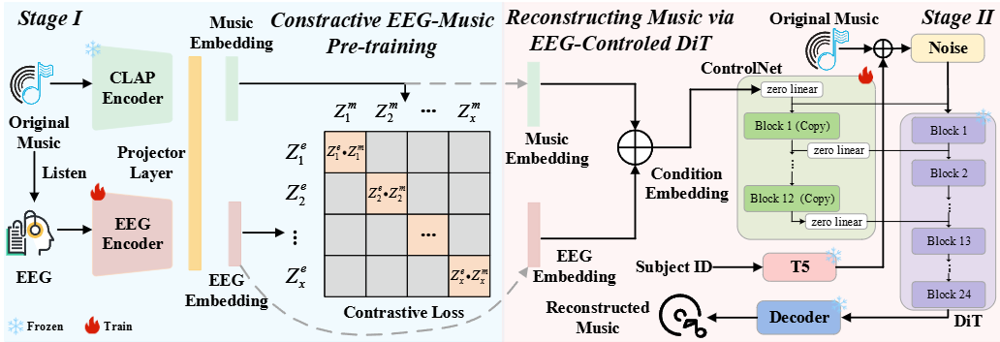

# Echoes of the Brain: Reconstructing Music from EEG via Latent Space Alignment and Guided Diffusion
## Abstract

Recent advances in brain computer interface technology have spurred growing interest in reconstructing content directly from electroencephalogram~(EEG) signals. Researchers initially focused on reconstructing images and speech from EEG signals and have since extended their efforts to music reconstruction. Nonetheless, although prior works succeeded in reconstructing music from EEG signals, they ignored the relationship between EEG and music representations, resulting in reconstructions of limited fidelity and accuracy. To overcome these limitations, we introduce a novel pipeline for EEG-driven music reconstruction. The pipeline comprises two stages. In the first stage, we utilise the proposed EEG encoder and a pre-trained large-scale music encoder to obtain the EEG and music representation. Also, we devise a dedicated training paradigm for the EEG encoder that projects EEG and music embeddings into a shared latent space, thereby achieving robust cross-modal alignment. In the second stage, we develop an EEG-based diffusion-transformer ControlNet that employs the EEG and music embeddings as conditioning inputs for music generation. Comprehensive experiments show that our proposed EEG encoder, together with its dedicated training paradigm, achieves effective alignment between EEG and music representations. The proposed pipeline is capable of reconstructing music with high accuracy and quality. These contributions suggest a potential way towards non-invasive, brain-driven music generation.

## Music Samples

### Music 1
 <table style="width: 100%;">
  <thead>
    <tr>
      <th style="width: 10%; border: 1px solid #ddd;"> </th> <!-- 第1列：10%宽度 -->
      <th style="width: 20%; border: 1px solid #ddd;">Original Music</th> <!-- 第2列：30%宽度 -->
      <th style="width: 20%; border: 1px solid #ddd;">Subject-independent</th> <!-- 第3列：30%宽度 -->
      <th style="width: 20%; border: 1px solid #ddd;">Subject-dependent</th> <!-- 第4列：30%宽度 -->
    </tr>
  </thead>
  <tbody>
    <tr>
      <th scope="row">Seg1</th>
      <td><audio controls><source src="audios/21_35.wav" type="audio/wav"></audio></td>
      <td><audio controls><source src="audios/21_35_re1.wav" type="audio/wav"></audio></td>
      <td><audio controls><source src="audios/21_35_re2.wav" type="audio/wav"></audio></td>
    </tr>
    <tr>
      <th scope="row">Seg2</th>
      <td><audio controls><source src="audios/21_40.wav" type="audio/wav"></audio></td>
      <td><audio controls><source src="audios/21_40_re1.wav" type="audio/wav"></audio></td>
      <td><audio controls><source src="audios/21_40_re2.wav" type="audio/wav"></audio></td>
    </tr>
    <tr>
      <th scope="row">Seg3</th>
      <td><audio controls><source src="audios/21_45.wav" type="audio/wav"></audio></td>
      <td><audio controls><source src="audios/21_45_re1.wav" type="audio/wav"></audio></td>
      <td><audio controls><source src="audios/21_45_re2.wav" type="audio/wav"></audio></td>
    </tr>
  </tbody>
</table>

### Music 2
 <table style="width: 100%;">
  <thead>
    <tr>
      <th style="width: 80px; border: 1px solid #ddd;"> </th> <!-- 第1列：10%宽度 -->
      <th style="width: 120px; border: 1px solid #ddd;">Original Music</th> <!-- 第2列：30%宽度 -->
      <th style="width: 120px; border: 1px solid #ddd;">Subject-independent</th> <!-- 第3列：30%宽度 -->
      <th style="width: 120px; border: 1px solid #ddd;">Subject-dependent</th> <!-- 第4列：30%宽度 -->
    </tr>
  </thead>
  <tbody>
    <tr>
      <th scope="row">Seg1</th>
      <td><audio controls><source src="audios/22_1.wav" type="audio/wav"></audio></td>
      <td><audio controls><source src="audios/22_1_re1.wav" type="audio/wav"></audio></td>
      <td><audio controls><source src="audios/22_1_re2.wav" type="audio/wav"></audio></td>
    </tr>
    <tr>
      <th scope="row">Seg2</th>
      <td><audio controls><source src="audios/22_13.wav" type="audio/wav"></audio></td>
      <td><audio controls><source src="audios/22_13_re1.wav" type="audio/wav"></audio></td>
      <td><audio controls><source src="audios/22_13_re2.wav" type="audio/wav"></audio></td>
    </tr>
    <tr>
      <th scope="row">Seg3</th>
      <td><audio controls><source src="audios/22_20.wav" type="audio/wav"></audio></td>
      <td><audio controls><source src="audios/22_20_re1.wav" type="audio/wav"></audio></td>
      <td><audio controls><source src="audios/22_20_re2.wav" type="audio/wav"></audio></td>
    </tr>
  </tbody>
</table>

